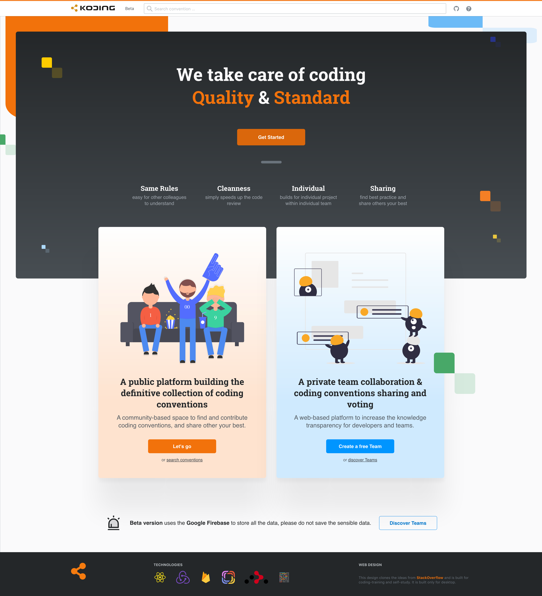

<div align="center">
  <h3>Koding: clean coding</h3>
  <p>A platform for building the definitive collection of coding conventions</p>


  <p>
    <a href="#">
      
    </a>
    <a href="#">
      
    </a>
  </p>
  
</div>

---

## Install

```bash
pnpm install 
```

## Development

```bash
pnpm run dev 
```

## Build

```bash
pnpm run build 
```

## licence

[MIT](./LICENSE) License © 2021 [@vikbert](https://vikbert.github.io/)
